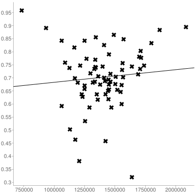

# Image Memorability and Social Media Likes

I was intrigued by the news headline that ["Scientists have uncovered exactly what makes a photo memorable"](https://www.washingtonpost.com/news/innovations/wp/2015/12/29/forget-beautiful-sunrises-embrace-absurdity-heres-how-to-take-memorable-photos/) and wanted to better understand whether this [LaMem](http://memorability.csail.mit.edu/index.html) algorithm might be able to predict the number of social media "likes" for a particular image.

Fortunately, it's relatively fast to use the Instagram API and LaMem API to get output data that can be graphed to better understand the correlation between social media "likes" and the "memscore".

I have not found any strong correlation. 

Here's the result based on (70 data points)[output-images-only.txt] from Taylor Swift (the most popular Instagram celebrity) from July to Oct 2015:

* X axis = Number of Instagram Likes
* Y axis = MemScore from the LaMem algorithm

* Correlation coefficient (r): -0.0933

Linear regression output via http://www.alcula.com/calculators/statistics/linear-regression/.

